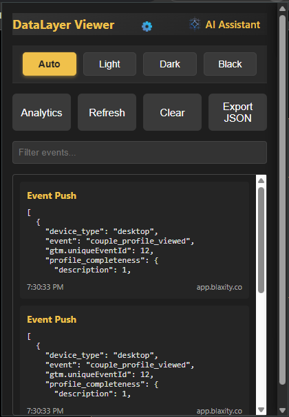

# DataLayer Viewer 

A Chrome extension for viewing and analyzing DataLayer events with Gemini AI integration.

## Features

- Real-time DataLayer event monitoring
- Event filtering and searching
- JSON export functionality
- Gemini AI assistant for event analysis
- Multiple theme options (light/dark/black/auto)
- System theme detection

## Installation

### Chrome Web Store

1. Visit [Chrome Web Store listing](#) (coming soon)
2. Click "Add to Chrome"

### Manual Installation

1. Download or clone this repository
2. Open Chrome and go to `chrome://extensions`
3. Enable "Developer mode"
4. Click "Load unpacked" and select the extension folder

## Usage

1. Click the extension icon in your toolbar
2. View captured DataLayer events
3. Use the filter to search events
4. Click "AI Assistant" to analyze events with Gemini AI

## Configuration

1. Open the extension popup
2. Click the settings icon (⚙️)
3. Enter your Gemini API key (get one from [Google AI Studio](https://ai.google.dev/))
4. Select your preferred theme

## Requirements

- Chrome browser (version 88 or later)
- Gemini API key (for AI functionality)

## Building

No build step required - just load the source files directly.

## Contributing

Pull requests are welcome! Please open an issue first to discuss changes.

## License

MIT © 2025 Natnael Getachew

## Contact

- **Author**: Natnael Getachew
- **Email**: [natnaeln4d@gmail.com](mailto:natnaeln4d@gmail.com)
- **GitHub**: [https://github.com/natnaeln4d]